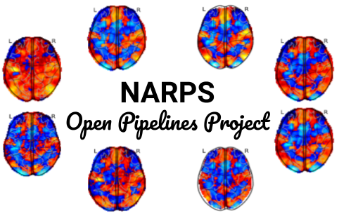

# NARPS Open Pipelines

	 

    
    
    
    

**The goal of the NARPS Open Pipelines project is to create a codebase reproducing the 70 pipelines of the NARPS study (Botvinik-Nezer et al., 2020) and share this as an open resource for the community**. 

We base our reproductions on the original descriptions provided by the teams and test the quality of the reproductions by comparing our results with the original results published on NeuroVault.

Find more information about the NARPS study [here](docs/narps.md).

:vertical_traffic_light: See [the pipeline dashboard](https://github.com/Inria-Empenn/narps_open_pipelines/wiki/pipeline_status) to view our current progress at a glance !

## Contributing

There are many ways you can contribute 🤗 :wave: Any help is welcome ! 

NARPS Open Pipelines uses [nipype](https://nipype.readthedocs.io/en/latest/index.html) as a workflow manager and provides a series of templates and examples to help reproducing the different teams’ analyses. Nevertheless knowing Python or Nipype is not required to take part in the project.

Follow the guidelines in [CONTRIBUTING.md](/CONTRIBUTING.md) if you wish to get involved !

## Using the codebase

To get the pipelines running, please follow the installation steps in [INSTALL.md](/INSTALL.md).

If you are interested in using the codebase, see the user documentation in [docs](/docs/) (work-in-progress).

## References

1. [Botvinik-Nezer, R. et al. (2020), ‘Variability in the analysis of a single neuroimaging dataset by many teams’, Nature.](https://www.nature.com/articles/s41586-020-2314-9)
2. [Carp, J. et al. (2012), ‘On the Plurality of (Methodological) Worlds: Estimating the Analytic Flexibility of fMRI Experiments’, Frontiers in Neuroscience.](https://www.frontiersin.org/articles/10.3389/fnins.2012.00149/full)
3. [Gorgolewski, K.J. et al. (2015), ‘NeuroVault.org: a web-based repository for collecting and sharing unthresholded statistical maps of the human brain’ Frontiers in Neuroinformatics.](https://www.frontiersin.org/articles/10.3389/fninf.2015.00008/full)
4. [Ioannidis, J.P.A. (2008), ‘Why Most Discovered True Associations Are Inflated’, Epidemiology.](https://pubmed.ncbi.nlm.nih.gov/18633328/)

## Funding

This project is supported by Région Bretagne (Boost MIND) and by Inria (Exploratory action GRASP). 

## Credits

This project is developed in the Empenn team by Boris Clénet, Elodie Germani, Jeremy Lefort-Besnard and Camille Maumet with contributions by Rémi Gau.

In addition, this project was presented and received contributions during the following events:
 - [Brainhack Marseille 2023](https://brainhack-marseille.github.io/) (December 2023): 
 - [ORIGAMI lab](https://neurodatascience.github.io/) hackathon (September 2023): 
 - [OHBM Brainhack 2023](https://ohbm.github.io/hackathon2023/) (July 2023): Arshitha Basavaraj, Boris Clénet, Rémi Gau, Élodie Germani, Yaroslav Halchenko, Camille Maumet, Paul Taylor.
 - [e-ReproNim FENS NENS Cluster Brainhack](https://repro.school/2023-e-repronim-brainhack/) (June 2023) : Liz Bushby, Boris Clénet, Michael Dayan, Aimee Westbrook.
 - [OHBM Brainhack 2022](https://ohbm.github.io/hackathon2022/) (June 2022): Elodie Germani, Arshitha Basavaraj, Trang Cao, Rémi Gau, Anna Menacher, Camille Maumet.
